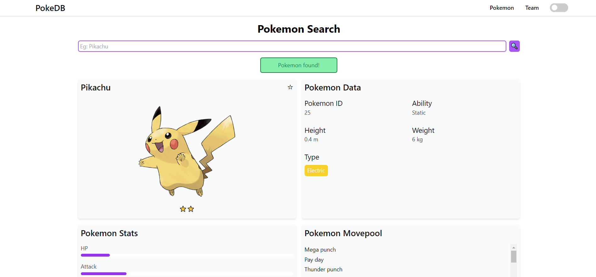

# Pokepedia - Pokemon Statistics and More

Pokepedia allows users to search for their favourite pokemon and get statistical information 
about them such as stats, type matchups, movepool and more. Users can also bookmark their favourite 
pokemon for easier lookup. Features custom hooks, light/dark modes, routing etc.

## Tech Stack
- React.js
- Tailwind CSS
- PokeAPI

## Requirements
- Node.js

## Steps
- Run the following command to install the required dependencies: <b>npm install</b>
- Run the following command to start the app: <b>npm start</b>